# doe-designer

Phase-only diffractive optical element (DOE) design from a grayscale target
image, with an animated view of the wavefront in the box between the DOE plane
and the target plane. C++20, FFTW, libpng, Catch2; documented with Doxygen.

A collimated laser illuminates a thin phase plate; the wave travels a distance
$d$ through free space; on the target plane its intensity should look like the
image. `doe_design` finds the phase plate (Gerchberg-Saxton baseline, then Adam
on a two-term energy, optionally quantized to a few phase levels) and writes
figures, metrics, and a volume file; `doe_view` shows that volume as an
animated box and lets you change the design parameters interactively.


Documentation: **[`docs/manual.md`](docs/manual.md)** for every option of
`doe_design` and every control of `doe_view`; [`docs/references.md`](docs/references.md)
for the code-to-paper traceability table.

## Build

```
git clone https://github.com/ai-sci-computing/doe-designer.git
cd doe-designer
cmake -B build -DCMAKE_BUILD_TYPE=Release
cmake --build build -j
ctest --test-dir build --output-on-failure
```

Dependencies (Homebrew on macOS): `fftw`, `libpng`, `catch2`, `glfw`,
optionally `libomp` (parallel loops), `doxygen` (`-DDOE_BUILD_DOCS=ON`,
target `docs`), `pandoc` and XeLaTeX (target `manual_pdf`). On Linux
(verified on Ubuntu 24.04 with GCC 13 in an external review, all tests
passing and the results table reproduced to the digit):
`apt-get install cmake libfftw3-dev libpng-dev catch2 pkg-config libglfw3-dev`,
or leave the native viewer out with `-DDOE_BUILD_VIEWER=OFF`. The performance
figures below are from an 11-core Apple machine.

## Use

```
./build/apps/doe_design --make-targets images/targets --active 512
./build/apps/doe_design --target images/targets/cross_ring.png --distance 0.05 --levels 4 --out results/cross_ring
./build/apps/doe_view results/cross_ring/volume.doev
./build/apps/doe_view --target images/natural/sudanese.png --init backprop --mu 0.02 --iters 1500
open viewer-web/index.html     # in the browser: pick an image, Run design; or open a volume.doev
```

Lengths on the command line are in meters (`--distance 0.05` is 5 cm, the
default pitch `--pitch 8e-6` is 8 µm, the default wavelength 532 nm). The
default aperture is 512 × 512 DOE pixels, computed on a zero-padded window
whose size follows from the distance: the FFT propagation is periodic in the
window, and the window is made just large enough that light wrapping around
its edge misses the picture, $S \ge N p + d \tan\theta_{\max}$ (720 px at the
defaults). Before optimizing, the tool prints a sampling report
(steepest ray, diffraction-limited spot, first-order spread, Fresnel number)
and warns when the geometry cannot resolve the target.

`doe_view` is the native viewer (GLFW, OpenGL, ImGui): it plays the wavefront
through the box between the DOE and the target plane, re-propagates to other
distances and re-runs the design with new parameters. The web viewer in
`viewer-web/` does the same in a browser without any installation: open
`index.html`, pick an image, press Run design. Its numerics are a JavaScript
port of the C++ core (FFT, band-limited angular spectrum, TIE and backprop
starts, Gerchberg-Saxton, Adam on the two-term energy, Wyrowski quantization,
metrics, vortex counting), cross-checked against `doe_design` in the test
suite, and it reads and writes the same `volume.doev`.

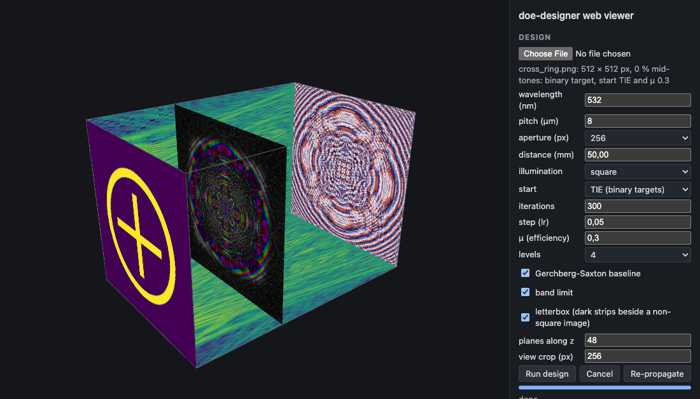

Every run writes to `--out`: the DOE phase (`phase.npy`, `phase.png`), the
reconstruction, `report.json` and `table.md` with the metrics of every solver
run, the convergence curves (`history.csv`, `convergence.svg`,
`convergence_terms.svg`), the four figures of the specification, the vortex
map, and `volume.doev` for the viewer. The manual lists them all.

## Results

All runs below use the defaults (532 nm, 8 µm pitch, 512 px aperture, 5 cm
distance, square illumination, 400 Adam iterations, `--mu 0.3`) and 4 phase
levels for the quantized run; the synthetic targets are the ones
`--make-targets` writes. Three solver runs per target:

- **gs**: Gerchberg-Saxton with Wyrowski's two stages (20 + 20 cycles), from the
  transport-of-intensity start.
- **adam**: Adam on the energy $E = (1 - p^2/(c\,s_2)) + \mu\,(1 - s_2/E_{\mathrm{in}})$,
  a scale-invariant shape term and an efficiency term, continuous phase.
- **adam_q4**: the same, with Wyrowski's stepwise quantization to 4 levels
  during the last 60 % of the budget, the capture range widened a little in
  every iteration (Škereň, Richter and Fiala 2002; `--quant-ramp linear`, the
  default).

Efficiency (light in the window over total light) and fidelity (amplitude RMSE,
NCC, PSNR of the intensities) are reported separately on purpose: they are in
tension, and a single score would hide the trade-off. Speckle contrast is
$\sigma/\langle I\rangle$ over the bright pixels; the last column counts phase
vortices in the bright regions, the mechanism behind speckle.

### Cross and ring

| run | efficiency | amplitude RMSE | speckle contrast | NCC | PSNR (dB) | vortices in bright /mm² | iterations | time (s) |
|---|---|---|---|---|---|---|---|---|
| initial (TIE) | 0.9983 | 0.7472 | 2.283 | 0.2175 | -5.49 | 461 | - | - |
| gs | 0.7721 | 0.0702 | 0.155 | 0.9861 | 24.61 | 2040 | 40 | 1.3 |
| adam | 0.9303 | 0.0804 | 0.181 | 0.9810 | 23.19 | 2130 | 400 | 5.7 |
| adam_q4 | 0.8417 | 0.1523 | 0.285 | 0.9517 | 18.85 | 2144 | 400 | 6.5 |

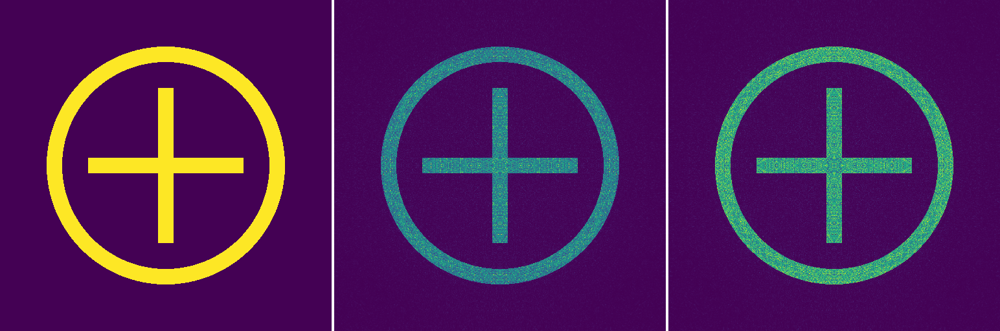

| DOE phase (4 levels) | xz cross section | vortices at the target plane |
|:---:|:---:|:---:|
| 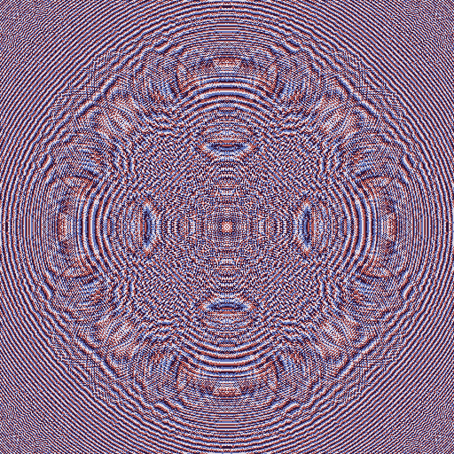 | 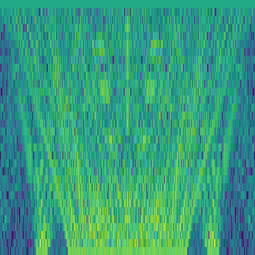 | 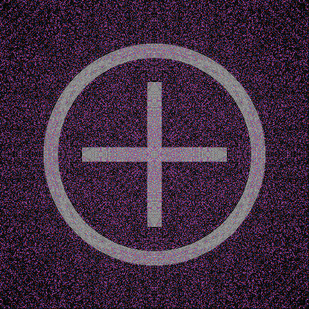 |

Six planes through the box between the DOE (left) and the target plane (right),
hue = phase, value = amplitude. The image forms only in the last plane:

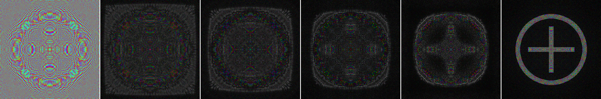

The convergence plot of the cross and ring shows the two energy terms
separately. The shape term (solid) is what the solvers drive down; the
efficiency term (dashed, same color) rises as the shape improves, which is the
trade-off `--mu` sets. From 40 % of the budget the green shape term rises
steadily: the quantizer's capture range grows by a small fixed amount every
iteration and freezes only the phases that fall into the new sliver, about
0.4 % of them per iteration. With Wyrowski's held table (`--quant-ramp table`)
the first step freezes 30 % of the phases at once and the same curve rises in
ten jumps:

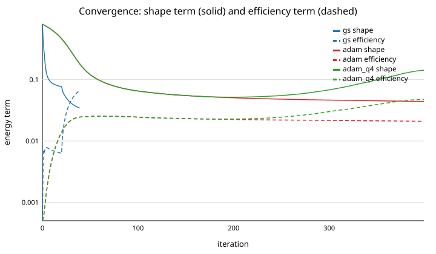

### 5 × 5 spot array

| run | efficiency | amplitude RMSE | speckle contrast | NCC | PSNR (dB) | vortices in bright /mm² | iterations | time (s) |
|---|---|---|---|---|---|---|---|---|
| initial (TIE) | 0.9894 | 0.7522 | 1.524 | 0.0967 | -2.18 | 462 | - | - |
| gs | 0.6980 | 0.0318 | 0.162 | 0.9867 | 32.80 | 2283 | 40 | 1.3 |
| adam | 0.9141 | 0.0369 | 0.189 | 0.9820 | 31.42 | 2139 | 400 | 5.3 |
| adam_q4 | 0.8294 | 0.0653 | 0.226 | 0.9738 | 29.68 | 2341 | 400 | 6.3 |

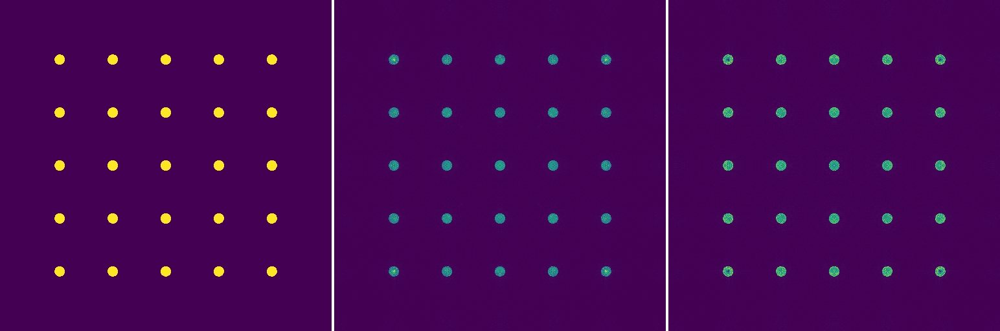

### Logo

| run | efficiency | amplitude RMSE | speckle contrast | NCC | PSNR (dB) | vortices in bright /mm² | iterations | time (s) |
|---|---|---|---|---|---|---|---|---|
| initial (TIE) | 0.9809 | 0.7728 | 1.592 | 0.1683 | -4.49 | 1598 | - | - |
| gs | 0.7837 | 0.0594 | 0.144 | 0.9883 | 26.13 | 3520 | 40 | 1.3 |
| adam | 0.9283 | 0.0682 | 0.168 | 0.9842 | 24.79 | 3657 | 400 | 5.4 |
| adam_q4 | 0.8424 | 0.1372 | 0.269 | 0.9583 | 20.30 | 3634 | 400 | 6.4 |

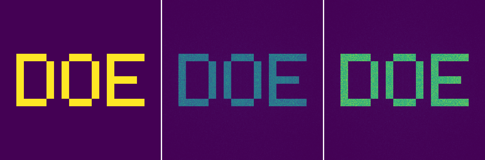

### Disk

| run | efficiency | amplitude RMSE | speckle contrast | NCC | PSNR (dB) | vortices in bright /mm² | iterations | time (s) |
|---|---|---|---|---|---|---|---|---|
| initial (TIE) | 0.8432 | 0.4716 | 1.716 | 0.3967 | -0.35 | 1204 | - | - |
| gs | 0.8824 | 0.0527 | 0.127 | 0.9901 | 24.96 | 4178 | 40 | 1.2 |
| adam | 0.9596 | 0.0600 | 0.147 | 0.9867 | 23.66 | 4320 | 400 | 5.4 |
| adam_q4 | 0.8690 | 0.1540 | 0.290 | 0.9477 | 17.36 | 4531 | 400 | 6.2 |

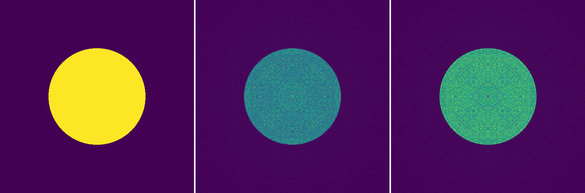

### Grating

| run | efficiency | amplitude RMSE | speckle contrast | NCC | PSNR (dB) | vortices in bright /mm² | iterations | time (s) |
|---|---|---|---|---|---|---|---|---|
| initial (TIE) | 0.9985 | 1.0826 | 1.176 | 0.0058 | -7.46 | 0 | - | - |
| gs | 0.8125 | 0.1084 | 0.217 | 0.9550 | 16.14 | 1260 | 40 | 1.2 |
| adam | 0.9423 | 0.1198 | 0.224 | 0.9518 | 15.84 | 1803 | 400 | 5.5 |
| adam_q4 | 0.8621 | 0.2327 | 0.398 | 0.8538 | 10.39 | 1741 | 400 | 6.5 |

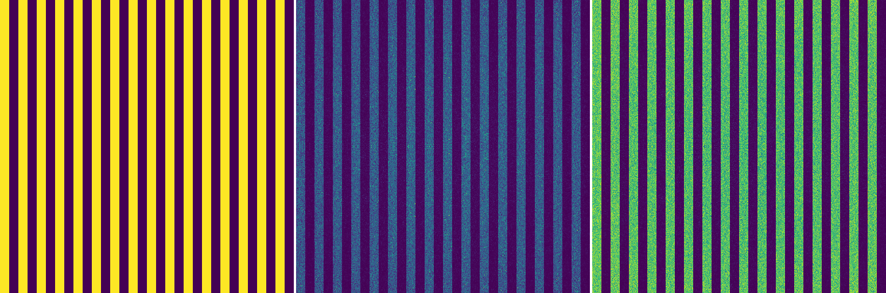

The grating is the target that suffers most from quantization: NCC falls from
0.95 to 0.85 at 4 levels, where the cross and ring lose 0.03. The reason is
measurable (`docs/quantization_noise.py`). Rounding a phase to $Z$ levels
turns $e^{i\varphi}$ into $\mathrm{sinc}(1/Z)\,e^{i\varphi}$ plus "false
images" (Goodman and Silvestri 1970; Wyrowski 1990, section 3.A and eq. 24), so
the false images carry $1 - \mathrm{sinc}^2(1/4) = 19\,\%$ of the light for
every design. On the five continuous designs, rounded to 4 levels without
continuation, that is exactly what is measured, and the false light lands the
same way every time: 62 to 66 % of it inside the window, spread uniformly
(its share in the dark pixels equals the dark area fraction). What differs is
how much signal it meets. The useful light is spread over 2 % of the window for
the spot array and over 50 % for the grating, so the signal-to-haze ratio per
bright pixel is 251 for the spot array and 13 for the grating, and the haze
interferes with the signal at a relative amplitude $2\sqrt{H/S}$ of 0.13 and
0.56. The loss follows the bright fraction monotonically:

| target | bright fraction of the window | signal / haze per bright pixel | NCC continuous → rounded | speckle contrast |
|---|---|---|---|---|
| spot array | 0.02 | 251 | 0.982 → 0.978 | 0.19 → 0.21 |
| logo | 0.11 | 43 | 0.984 → 0.957 | 0.17 → 0.27 |
| cross and ring | 0.14 | 35 | 0.981 → 0.947 | 0.18 → 0.30 |
| disk | 0.20 | 22 | 0.987 → 0.936 | 0.15 → 0.32 |
| grating | 0.50 | 13 | 0.952 → 0.827 | 0.22 → 0.43 |

The continuation schedule recovers little of this (grating NCC 0.85 against
0.83 for plain rounding), because it can move false light between the window
and the surround but cannot change the ratio. Dense targets need more levels:
with 8 levels the false images carry 5 % and the grating reaches NCC 0.92 /
PSNR 13.3 dB at efficiency 0.92 (`--levels 8`, same budget; the cross and
ring NCC 0.97 / 21.4 dB at 0.90). The PSNR of the grating is low for every
run for the same reason: half of the window is bright and speckled, so the
mean-square error is large even when the pattern is right.

### A rendered image

Continuous-tone images need the back-propagation start and a small efficiency
weight (`--init backprop --mu 0.02 --iters 1500`, the manual's recipe). The
target is a shaded rendering (`images/natural/sudanese.png`, 478 × 376 px RGBA,
converted to luminance). A non-square target keeps its aspect ratio: the
longer side fills the aperture, and the strips beside the image inside the
square aperture are dark targets (a letterbox), so the surplus light goes to
the far padding rather than next to the picture. With `--no-letterbox` the
strips are don't-care instead: on this image that raises the efficiency from
0.86 to 0.91 and the PSNR from 26.5 to 30 dB, but puts 7 % of the light into
the strips at 30 % of the image's brightness, a visible band beside the
picture (the metrics are evaluated on the image rectangle in both modes).
No quantization. The Gerchberg-Saxton baseline reproduces a continuous-tone
target poorly (NCC 0.76); Adam reaches NCC 0.96 and 26.5 dB.

| run | efficiency | amplitude RMSE | speckle contrast | NCC | PSNR (dB) | vortices in bright /mm² | iterations | time (s) |
|---|---|---|---|---|---|---|---|---|
| initial (backprop) | 0.9301 | 0.2933 | 0.967 | 0.0915 | 0.22 | 0 | - | - |
| gs | 0.8991 | 0.0690 | 0.179 | 0.7613 | 17.54 | 75 | 40 | 1.4 |
| adam | 0.8627 | 0.0240 | 0.138 | 0.9640 | 26.64 | 300 | 1500 | 22.9 |

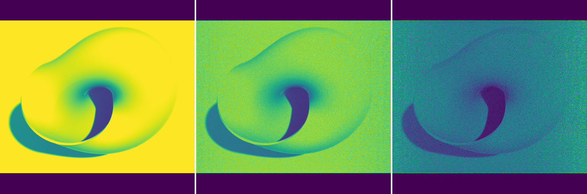

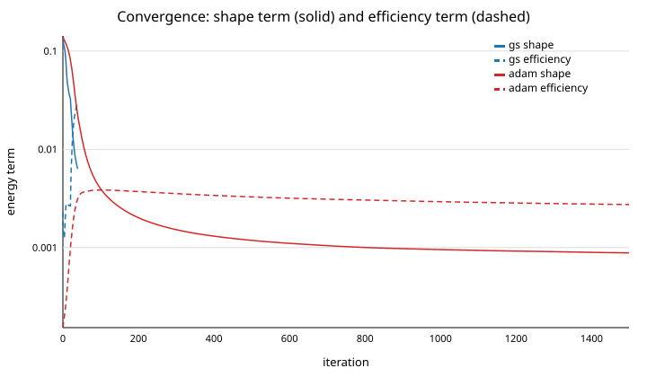

### Reading the numbers

- At these settings the diffraction-limited spot is 0.8 target pixels and the
  Fresnel number 630: the geometry resolves the targets and the sampling
  report has no warnings. Halving the aperture to 256 px doubles the spot to
  1.6 px and the tool warns that finer detail is unreachable.
- Gerchberg-Saxton reaches the best fidelity but pays in efficiency; Adam with
  `--mu 0.3` gives up a little fidelity for 0.9 or more of the light in the
  window. Quantization to 4 levels costs a few dB of PSNR and some efficiency,
  more for targets with a large bright area (see the grating).
- The vortex density in the bright regions stays high for every binary
  design started from the transport-of-intensity phase: the speckle is a
  property of those phase-only designs, not a convergence problem. The
  continuous-tone run has 6 to 14 times fewer vortices because the
  back-propagated start carries none and the solver creates few.
- The speckle-contrast column is only meaningful for targets with uniform
  bright regions; for the rendered image it measures the image's own shading.

## Performance

FFTW threaded plans and OpenMP loops (all cores by default, `--threads N`).
One gradient step in double precision takes 5.4 ms on a 512 × 512 padded
window and 27 ms at 1024 × 1024 on an 11-core Apple machine; each 400-iteration
Adam run above takes 5 to 7 s, the Gerchberg-Saxton baseline 1.3 s.

## Project layout

```
include/doe/   public headers (one per module: grid, fft, propagate, energy, solvers, quantize, ...)
src/           implementation
apps/          doe_design (CLI) and doe_view (GLFW / OpenGL / ImGui viewer)
viewer-web/    browser version: JavaScript port of the core (core/), design in a Web Worker, Three.js box; tests in test/
tests/         Catch2, one executable per module, spec tests T1-T14
docs/          manual, references (bib + traceability table), figures, Doxygen output
images/        synthetic targets
```

## References

The papers and books the code implements or measures against. Every routine cites its
equation in the source, and [`docs/references.md`](docs/references.md) maps the routines to
these entries.

### Propagation, sampling and the computational window

- Goodman, J. W. *Introduction to Fourier Optics.* W. H. Freeman, 4 ed., 2017.
- Born, M. and Wolf, E. *Principles of Optics.* Cambridge University Press, 7 ed., 1999.
- Matsushima, K. and Shimobaba, T. *Band-Limited Angular Spectrum Method for Numerical Simulation of Free-Space Propagation in Far and Near Fields.* Optics Express 17, 19662–19673 (2009). doi:10.1364/OE.17.019662
- Wyant, J. C. *Fresnel Diffraction.* Lecture notes, College of Optical Sciences, University of Arizona.
- Lord Rayleigh. *On copying diffraction-gratings, and on some phenomena connected therewith.* Philosophical Magazine 11, 196–205 (1881). doi:10.1080/14786448108626995
- Montgomery, W. D. *Self-Imaging Objects of Infinite Aperture.* Journal of the Optical Society of America 57, 772–778 (1967). doi:10.1364/JOSA.57.000772
- Kyvalý, J. *The self-imaging phenomenon and its applications.* Photonics, Devices, and Systems II, Proc. SPIE 5036, 129–134 (2003). doi:10.1117/12.498261
- Siegman, A. E. *Lasers.* University Science Books, 1986.
- Frigo, M. and Johnson, S. G. *FFTW 3.3.10 manual, Introduction.* https://www.fftw.org/fftw3_doc/Introduction.html.
- SciPy developers. *scipy.fftpack.next_fast_len.* https://docs.scipy.org/doc/scipy/reference/generated/scipy.fftpack.next_fast_len.html.
- Feit, M. D. and Fleck, J. A., Jr. *Light propagation in graded-index optical fibers.* Applied Optics 17, 3990–3998 (1978). doi:10.1364/AO.17.003990
- Hadley, G. R. *Transparent boundary condition for the beam propagation method.* IEEE Journal of Quantum Electronics 28, 363–370 (1992). doi:10.1109/3.119536
- Huang, W. P., Xu, C. L., Lu, W. and Chaudhuri, S. K. *The perfectly matched layer (PML) boundary condition for the beam propagation method.* IEEE Photonics Technology Letters 8, 649–651 (1996). doi:10.1109/68.491568
- Bérenger, J. P. *A perfectly matched layer for the absorption of electromagnetic waves.* Journal of Computational Physics 114, 185–200 (1994). doi:10.1006/jcph.1994.1159

### Starting phase

- Teague, M. R. *Deterministic phase retrieval: a Green's function solution.* Journal of the Optical Society of America 73, 1434–1441 (1983). doi:10.1364/JOSA.73.001434
- Paganin, D. and Nugent, K. A. *Noninterferometric Phase Imaging with Partially Coherent Light.* Physical Review Letters 80, 2586–2589 (1998). doi:10.1103/PhysRevLett.80.2586
- Zuo, C., Li, J., Sun, J., Fan, Y., Zhang, J., Lu, L., Zhang, R., Wang, B., Huang, L. and Chen, Q. *Transport of intensity equation: a tutorial.* Optics and Lasers in Engineering 135, 106187 (2020). doi:10.1016/j.optlaseng.2020.106187

### Phase retrieval and optimization

- Gerchberg, R. W. and Saxton, W. O. *A practical algorithm for the determination of phase from image and diffraction plane pictures.* Optik 35, 237–246 (1972).
- Fienup, J. R. *Iterative method applied to image reconstruction and to computer-generated holograms.* Optical Engineering 19, 297–305 (1980). doi:10.1117/12.7972513
- Fienup, J. R. *Phase retrieval algorithms: a comparison.* Applied Optics 21, 2758–2769 (1982). doi:10.1364/AO.21.002758
- Fienup, J. R. *Invariant error metrics for image reconstruction.* Applied Optics 36, 8352–8357 (1997). doi:10.1364/AO.36.008352
- Wyrowski, F. and Bryngdahl, O. *Iterative Fourier-transform algorithm applied to computer holography.* Journal of the Optical Society of America A 5, 1058–1065 (1988). doi:10.1364/JOSAA.5.001058
- Ripoll, O., Kettunen, V. and Herzig, H. P. *Review of iterative Fourier-transform algorithms for beam shaping applications.* Optical Engineering 43, 2549–2556 (2004). doi:10.1117/1.1804543
- Kreutz-Delgado, K. *The Complex Gradient Operator and the CR-Calculus.* (2009). doi:10.48550/arXiv.0906.4835
- Candès, E. J., Li, X. and Soltanolkotabi, M. *Phase Retrieval via Wirtinger Flow: Theory and Algorithms.* IEEE Transactions on Information Theory 61, 1985–2007 (2015). doi:10.1109/TIT.2015.2399924
- Kingma, D. P. and Ba, J. *Adam: A Method for Stochastic Optimization.* 3rd International Conference on Learning Representations (ICLR) (2015). doi:10.48550/arXiv.1412.6980
- Chakravarthula, P., Peng, Y., Kollin, J., Fuchs, H. and Heide, F. *Wirtinger Holography for Near-Eye Displays.* ACM Transactions on Graphics 38, 213:1–213:13 (2019). doi:10.1145/3355089.3356539
- Peng, Y., Choi, S., Padmanaban, N. and Wetzstein, G. *Neural Holography with Camera-in-the-loop Training.* ACM Transactions on Graphics 39, 185:1–185:14 (2020). doi:10.1145/3414685.3417802
- Zhang, J., Pegard, N., Zhong, J., Adesnik, H. and Waller, L. *3D computer-generated holography by non-convex optimization.* Optica 4, 1306–1313 (2017). doi:10.1364/OPTICA.4.001306
- Wang, F., Lazarov, B. S. and Sigmund, O. *On projection methods, convergence and robust formulations in topology optimization.* Structural and Multidisciplinary Optimization 43, 767–784 (2011). doi:10.1007/s00158-010-0602-y

### Quantization

- Goodman, J. W. and Silvestri, A. M. *Some effects of Fourier-domain phase quantization.* IBM Journal of Research and Development 14, 478–484 (1970). doi:10.1147/rd.145.0478
- Wyrowski, F. *Diffractive optical elements: iterative calculation of quantized, blazed phase structures.* Journal of the Optical Society of America A 7, 961–969 (1990). doi:10.1364/JOSAA.7.000961
- Škereň, M., Richter, I. and Fiala, P. *Iterative Fourier transform algorithm: comparison of various approaches.* Journal of Modern Optics 49, 1851–1870 (2002). doi:10.1080/09500340210140542
- Choi, S., Gopakumar, M., Peng, Y., Kim, J., O'Toole, M. and Wetzstein, G. *Time-multiplexed Neural Holography: A Flexible Framework for Holographic Near-eye Displays with Fast Heavily-quantized Spatial Light Modulators.* ACM SIGGRAPH 2022 Conference Proceedings (2022). doi:10.1145/3528233.3530734
- Dammann, H. and Görtler, K. *High-efficiency in-line multiple imaging by means of multiple phase holograms.* Optics Communications 3, 312–315 (1971). doi:10.1016/0030-4018(71)90095-2
- Krackhardt, U. and Streibl, N. *Design of Dammann-gratings for array generation.* Optics Communications 74, 31–36 (1989). doi:10.1016/0030-4018(89)90484-1

### Speckle and phase vortices

- Aagedal, H., Schmid, M., Beth, T., Teiwes, S. and Wyrowski, F. *Theory of speckles in diffractive optics and its application to beam shaping.* Journal of Modern Optics 43, 1409–1421 (1996). doi:10.1080/09500349608232777
- Senthilkumaran, P., Wyrowski, F. and Schimmel, H. *Vortex stagnation problem in iterative Fourier transform algorithms.* Optics and Lasers in Engineering 43, 43–56 (2005). doi:10.1016/j.optlaseng.2004.06.002
- Goldstein, R. M., Zebker, H. A. and Werner, C. L. *Satellite radar interferometry: Two-dimensional phase unwrapping.* Radio Science 23, 713–720 (1988). doi:10.1029/RS023i004p00713
- Fried, D. L. and Vaughn, J. L. *Branch cuts in the phase function.* Applied Optics 31, 2865–2882 (1992). doi:10.1364/AO.31.002865
- Berry, M. V. and Dennis, M. R. *Phase singularities in isotropic random waves.* Proceedings of the Royal Society of London A 456, 2059–2079 (2000). doi:10.1098/rspa.2000.0602
- Dennis, M. R., O'Holleran, K. and Padgett, M. J. *Singular Optics: Optical Vortices and Polarization Singularities.* In Progress in Optics, 293–363 (Elsevier, 2009). doi:10.1016/S0079-6638(08)00205-9
- Goodman, J. W. *Speckle Phenomena in Optics: Theory and Applications.* Roberts & Company, 2007.

## License

Free for personal, academic, and research use. No warranty. No commercial use.
