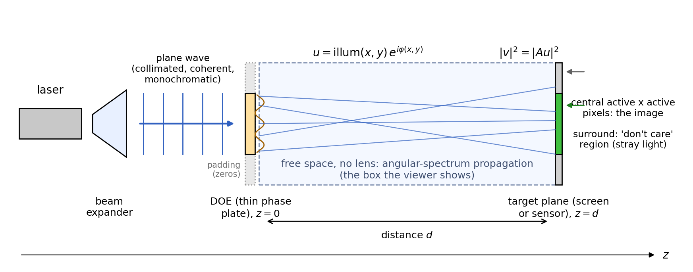

Two programs share one library: `doe_design` computes a phase-only diffractive
optical element (DOE) for a target image and writes figures and data files;
`doe_view` shows the wavefront between the DOE and the target plane in an
animated box and lets you change parameters interactively. A browser version,
`viewer-web/index.html`, designs from an image and shows the same box without
any installation (section 4).

```
./build/apps/doe_design --target images/targets/cross_ring.png --distance 0.05 --levels 4 --out results/cross_ring
./build/apps/doe_view results/cross_ring/volume.doev
./build/apps/doe_view --target images/natural/sudanese.png --init backprop --mu 0.02 --iters 1500
```

All lengths are in meters on the command line (`0.05` = 5 cm, `8e-6` = 8 $\mu$m);
the viewer's sliders use mm, $\mu$m and nm.

## 1. The physical setup



The light source is a collimated laser at infinity: a monochromatic plane wave
traveling along +z hits the DOE at normal incidence. Nothing in front of the
DOE is modeled; the beam is described by its transverse amplitude on the DOE
(`--illum`: uniform square, uniform disk, or a Gaussian TEM00 profile with $1/e$
amplitude radius equal to half the aperture, cut at the aperture). Beam power is
irrelevant: objective and metrics are scale-invariant. The DOE is a thin,
lossless phase plate: the field just behind it is the illumination times
$e^{i\varphi}$; for a surface relief of height $h$ in a material of index $n$ the phase
is $2\pi (n - 1) h / \lambda$ (fabrication is not modeled). Between the DOE and
the target plane there is free space and nothing else, no lens, no filter;
the propagation is the exact scalar (angular spectrum) solution, so this is a
near-field / Fresnel design and the image forms only at $z = d$. The target
plane is a screen or sensor with the DOE's pixel pitch, looking at the
intensity. Not modeled: reflection, absorption, partial coherence, several
wavelengths, and the source's own divergence (a diverging source would be a
quadratic phase added to the illumination).

In numbers: the DOE has $N \times N$ pixels (`--active`) of pitch $p$ and
imprints a phase $\varphi(x, y)$. The wave propagates a distance $d$ to the
target plane, where its intensity should look like the target image,
resampled with its aspect ratio kept so that its longer side is $N$ pixels of
the same pitch. Everything is computed on a zero-padded window whose side
$S$ is chosen from the distance: the FFT propagation is periodic in the window,
so light leaving the plate edge at the steepest angle $\theta_{\max}$ re-enters
from the opposite side, and $S \ge N p + d \tan\theta_{\max}$ keeps that
wrapped light out of the picture (720 px, rounded to a 7-smooth number, at the
defaults; 480 px for a 256 px plate at 50 mm; 945 px at 100 mm). The wrapped
light lands in the far don't-care strip, where nothing is evaluated. The
target occupies the central
$N \times N$ region (for a non-square image a centered $N \times M$ rectangle
with dark strips beside it), the rest of the target plane is a "don't care"
region that may receive stray light.

Before any optimization `doe_design` prints a **sampling report**:

| quantity | formula | what it tells you |
|:---------------|:----------------------|:-----------------------------------------------------|
| max angle | $\theta_{\max} = \arcsin(\lambda / 2p)$ | the steepest ray the DOE pixels can produce |
| spot size | $\lambda d / (N p)$ | the finest detail the target plane can show; if it exceeds 1 px the tool warns and fine target detail is physically unreachable |
| first-order spread | $2 d \tan\theta_{\max}$ | how far the DOE can throw light; must fit in the window |
| Fresnel number | $(N p)^2 / (\lambda d)$ | $\gg 1$ means near field (this tool's regime); the image forms by Fresnel diffraction, not by a Fourier transform |

Rules of thumb: to sharpen the spot, use a larger aperture (`--active`) or a
shorter distance; to widen the reachable image, use a smaller pitch.

## 2. `doe_design` options

### Geometry

| option | default | meaning |
|:---------------------|:----------|:-----------------------------------------------------------|
| `--target PATH` | required | 8-bit PNG, gray or RGB (luminance is used; an alpha channel is ignored). Resampled bilinearly so that the longer side is `active` pixels, aspect ratio kept; a non-square image is letterboxed: the strips beside it inside the square aperture are dark targets (see `--no-letterbox`). Values are intensities in [0, 1]. |
| `--no-letterbox` | | non-square image: make the signal window the image rectangle only, so that the strips beside it are "don't care" and receive the surplus light. Measured on the rendered shell (256 px, backprop, $\mu = 0.02$): 6.8 % of the light in the strips at 30 % of the image's brightness against 0.2 % with the letterbox, for 4 % more efficiency and 2 dB more PSNR. The metrics are evaluated on the image rectangle in both modes. |
| `--active N` | 512 | DOE side in pixels. Runtime scales with the padded window (see above), roughly a quarter of the time at half the aperture. |
| `--pitch M` | 8e-6 | DOE pixel pitch. Smaller pitch = larger diffraction angles = larger reachable image, at the cost of fabrication difficulty. |
| `--wavelength M` | 532e-9 | vacuum wavelength of the illumination. |
| `--distance M` | 0.05 | DOE-to-target distance. Enters the transfer function $e^{i k_z d}$; a DOE designed for one distance forms its image only there (see the xz cut). |
| `--illum square`, `disk`, `gaussian` | square | illumination amplitude on the aperture: uniform square, uniform disk inscribed in the square, or a Gaussian with $1/e$ amplitude radius equal to half the half-aperture, truncated at the aperture. Hard edges radiate Fresnel tails; the Gaussian is the gentlest. |
| `--soft-edge S` | 0 | Gaussian blur of the target in pixels before the design. Useful when the spot size exceeds 1 px: it removes detail the optics cannot reproduce anyway. |
| `--no-band-limit` | off | disables the Matsushima-Shimobaba band limit of the propagator. Only for experiments; at long distances the unlimited transfer function aliases. |

### Optimization

| option | default | meaning |
|:---------------------|:----------|:-----------------------------------------------------------|
| `--init tie`, `random`, `backprop` | tie | starting phase. `tie`: transport-of-intensity solution of the Poisson equation, best for sparse targets on a dark background (logos, spot arrays). `backprop`: phase of the back-propagated target with a flat phase (the classical Gerchberg-Saxton start), best for full-field images such as photographs. `random`: uniform random phase, the reference case; it starts in a basin full of optical vortices and gives the most speckle. |
| `--seed N` | 0 | seed of the random phase and of the Gumbel noise of the Choi quantizer. |
| `--iters N` | 400 | Adam iterations. Most of the gain comes in the first ~150; continuing to 1000+ improves fidelity by tenths of a dB. |
| `--lr X` | 0.05 | Adam step size on the phase (radians per step, roughly). 0.05 is robust; smaller values converge more slowly, larger ones can oscillate. |
| `--mu X` | 0.3 | weight of the efficiency term. The objective is $E = \text{shape} + \mu\,(1 - \text{efficiency})$: the shape term is the scale-invariant normalized error of the amplitude on the target window (Fienup 1997), efficiency is the fraction of light landing in that window. Larger $\mu$: more light in the image, more speckle; smaller $\mu$: cleaner image, more light lost to the surround. Typical: 0.3 for sparse binary targets (efficiency about 0.85, NCC about 0.96), 0.02 to 0.05 for photographs (efficiency about 0.75, PSNR about 28 dB). $\mu = 0$ is degenerate (the optimizer empties the window; T13). |
| `--gs-cycles A,B` | 20,20 | Gerchberg-Saxton stage lengths: A cycles with the field zeroed outside the picture, then B with the amplitude free. The efficiency slide of the free stage (README, blog) is reproduced with `--gs-cycles 20,60`. |
| `--no-gs` | off | skip the Gerchberg-Saxton baseline (Wyrowski's two-stage IFTA, 20 + 20 cycles). GS is fast and reaches high fidelity with lower efficiency; it is reported for comparison. |
| `--levels Q` | 0 | quantize the phase to Q levels (0 = continuous). measured on the README targets, 4 levels keep about 90 % of the continuous efficiency and 8 levels about 97 %: the $\mathrm{sinc}^2(1/Q)$ rule (81 % and 95 %) governs the light in the primary image, and about two thirds of the false-image light still lands inside the window, which the efficiency counts; the fidelity loss is what shows (README, "Grating"). 2 levels are binary and suffer from the twin-image symmetry. |
| `--quant wyrowski`, `choi` | wyrowski | quantization method. `wyrowski`: stepwise projection with a growing capture interval (Wyrowski 1990); `choi`: hard quantizer in the forward pass, Gumbel-Softmax surrogate gradient in the backward pass (Choi et al. 2022, Supplement S2.3 parameters). Measured on the test target: Wyrowski loses 1.3 dB versus the continuous design, Choi 2.0 dB, plain rounding 1.9 dB. |
| `--quant-start X` | 0.4 | fraction of the Adam budget spent continuous before quantization begins. |
| `--quant-ramp linear`, `table` | linear | how the capture range of the stepwise quantizer grows over the stage. `linear`: a new, slightly larger range in every iteration, from zero to the full half spacing (Škereň, Richter and Fiala 2002, their approach I); `table`: Wyrowski's ten values 0.3 ... 1, each held for a tenth of the stage. Measured at 2, 4 and 8 levels the linear ramp ends 1 to 3 % lower in energy. |
| `--choi-gain A,B` | 300,1000 | Choi: scale of the score function ramped from A to B over the quantization stage. |
| `--choi-tau X` | 4 | Choi: initial softmax temperature; it decays by a factor $e^{-\ln 2}$ over the stage. |
| `--single` | off | single-precision solvers (float). About 1.3 times faster; the transfer function is still built in double. Results agree with double to four decimals in the metrics (T14). |
| `--threads N` | 0 = all cores | FFTW and OpenMP threads. Results are identical to 1e-13 across thread counts. |

### Output and visualization

| option | default | meaning |
|:---------------------|:----------|:-----------------------------------------------------------|
| `--out DIR` | results | output directory (created). |
| `--nz N` | 96 | planes of the volume sweep between z = 0 and z = distance. |
| `--view-size N` | min(active, 384) | side of the central crop stored per plane in `volume.doev` and used in figures 2-4. Memory per plane is about 9 bytes per pixel of the crop. |
| `--make-targets DIR` | | write the synthetic targets (cross + ring, 5 by 5 spot array, "DOE" logo, disk, grating) as PNGs of side `--active` and exit. |

### Output files

| file | content |
|:-------------------------|:-------------------------------------------------------------|
| `phase.npy`, `phase.png` | the final DOE phase on the active aperture (NumPy float64 `[i, j]` with `i` along $x$; twilight color map). Quantized if `--levels` was given. |
| `phase_<run>.npy/.png`, `reconstruction_<run>.png` | the same per solver run: `gs`, `adam`, `adam_qQ`. |
| `reconstruction.png`, `target.png` | target-plane intensity of the final design and the target, full padded window, viridis. |
| `report.json` | configuration, sampling report with warnings, metrics of the start and of every run, timings. |
| `table.md` | the metrics table (efficiency and RMSE in separate columns on purpose). |
| `history.csv`, `convergence.svg`, `convergence_terms.svg` | energy per iteration for every run; the CSV also has the shape and efficiency terms per run (`<run>_shape`, `<run>_efficiency`), and the second plot draws them as separate curves (shape solid, efficiency dashed, one color per run). |
| `fig1_doe_phase.png` | figure 1: DOE phase (cyclic map, levels visible). |
| `fig2_target_reconstruction.png` | figure 2: target, reconstruction, absolute difference, side by side on the same scale. |
| `fig3_xz_cross_section.png`, `xz_cut.png`, `yz_cut.png` | figure 3: log intensity through the center, DOE at the top, target plane at the bottom. Shows whether the image forms in one plane. |
| `fig4_hsv_planes.png` | figure 4: six planes through the box as HSV (hue = phase, value = amplitude); vortices are points around which the hue wheel closes once. |
| `vortex_map.png` | target-plane intensity in gray with vortex residues marked (red $+1$, blue $-1$). |
| `vortex_density.svg` | vortices per mm$^2$ against $z$. |
| `volume.doev` | the sweep for the viewer: per plane amplitude, phase and vortex charges (cropped), the xz/yz cuts, and (format v2) the full-resolution DOE, illumination, target and geometry so the viewer can re-sweep. |

## 3. Metrics

All on the target window (the active region of the target plane).

| metric | definition | reading |
|:--------------|:--------------------------------|:-----------------------------------|
| efficiency | light in the window divided by total light | what the DOE delivers; the rest lands in the surround |
| amplitude RMSE | RMS of $|v| - s\,b$ over the window after least-squares scaling, divided by the peak of $s\,b$ | shape error; 0.07 to 0.10 is typical of a good design |
| speckle contrast | $\sigma / \langle I \rangle$ of the intensity over pixels whose target is above half maximum | 1 = fully developed speckle; 0.2 to 0.3 typical; only meaningful for targets with uniform bright regions (for photographs it measures the image's own tonal range) |
| NCC | Pearson correlation of intensity and target intensity | above 0.9 the pattern is right; NaN for a constant target |
| PSNR | $10 \log_{10}(\text{peak}^2 / \text{MSE})$ of the intensities | 18 to 22 dB for speckled binary targets, 25 to 30 dB for photographs with `--init backprop` |
| vortices in bright / mm$^2$ | plaquette residues whose four corners are bright pixels, per bright area | the mechanism behind speckle: fewer vortices in the bright features means smoother features |

Efficiency and fidelity are in tension; they are reported separately so that a
design's trade-off is visible (a single score would hide it).

## 4. `doe_view`

### Starting it

- `doe_view FILE.doev`: open a result. Everything except the design itself can be changed.
- `doe_view --target IMAGE.png [options]`: all `doe_design` options are accepted; the design runs in the background (progress bar, cancel) and the box appears when it is done. Parameters can then be changed and re-run.
- `--screenshot out.png`: render offscreen and exit (used by the smoke test).

Mouse: drag to orbit, scroll to zoom. The box spans the DOE plane (entry face)
to the target plane (exit face); x and y are the view crop, z is compressed
(see Box).

### Playback

| control | meaning |
|:--------------------|:---------------------------------------------------------------|
| Play / Pause, bounce | move the slice through the planes; bounce reverses at the ends instead of wrapping |
| plane, z | the current plane and its distance |
| planes / s | playback speed |
| slice | what the moving slice shows: **intensity** (linear, viridis), **log intensity** (dynamic range = log floor), **HSV** (hue = phase of the complex envelope, value = amplitude; the standard way to see phase structure and vortices), **vortices** (gray intensity with red/blue residues), **real part** ($\mathrm{Re}[u\,e^{-i\omega t}]$ on a blue-white-red map: the physical field with crests and troughs) |
| log floor (dB) | dynamic range of the log mode and of the wall textures |
| gamma | contrast of the intensity modes |
| animate in time | advances the display time $t$; in real-part mode the crests move, in HSV mode the hues rotate. $\omega$ is a display rate, not the optical frequency |
| vortices in this plane, vortex density vs $z$ | count and density of residues in the current plane, and the curve along z |

### Box

| control | meaning |
|:--------------------|:---------------------------------------------------------------|
| $z$ compression | depth of the box relative to its width (the real box is very elongated: 50 mm long, 2 mm wide) |
| walls, wall opacity | the xz (bottom) and yz (side) log-intensity cuts |
| faces | entry face = DOE phase, exit face = target or reconstruction |

### Sweep (available in both modes)

| control | meaning |
|:--------------------|:---------------------------------------------------------------|
| planes along $z$ | $z$ resolution of the sweep |
| view crop | side of the crop around the axis |
| distance | the plane at the end of the sweep; the DOE was designed for the distance in the file, so moving this shows how the image defocuses |
| sweep to (times distance) | extend the sweep beyond the design distance |
| Re-propagate | recompute the volume from the full-resolution DOE (seconds) |

### Design parameters (only with `--target`)

The same quantities as the `doe_design` options: wavelength, pitch, aperture,
illumination, initialization and seed, iterations, learning rate, $\mu$, levels
and quantization method, band limit, GS baseline. "Run design" starts a new
optimization on a worker thread; the Sweep section then shows the new result.
The Metrics table lists every run of the last design and the energy curve.

### Web viewer

`viewer-web/index.html` is the browser version: it takes a target image, runs
the design and shows the same box, with no installation and no server (plain
HTML, classic scripts, Three.js from a CDN; the numerics are a line-by-line
JavaScript port of the C++ core, cross-checked against `doe_design` in the
test suite). Open the page from the file system, pick a PNG or JPEG under
**Design** (luminance is used, aspect ratio kept), set the parameters, and
press **Run design**. The design runs in a Web Worker with a progress bar and
can be canceled; afterwards the Metrics table lists every run with the
convergence curves (shape solid, efficiency dashed), the sampling report and
its warnings appear under the button, and the box shows the swept volume.

Loading an image sets the start and $\mu$ from its tone content (section 5's
recipes: binary targets TIE and $\mu = 0.3$, images with more than 5 % of
mid-tone pixels backprop and $\mu = 0.02$; both fields stay editable; on the
shell image the binary defaults would give NCC 0.54 instead of 0.98).
Parameters are the ones of `doe_design`: wavelength, pitch, aperture,
distance, illumination, start (TIE, backprop, random), iterations, step,
$\mu$, levels (Wyrowski's stepwise quantization; Choi's method is not ported),
the Gerchberg-Saxton baseline and the band limit, plus the sweep's plane
count and view crop. Speed (JavaScript, one thread, measured in headless
Chrome on an 11-core Apple machine): 4 s for a 128 px aperture with 60
iterations, 40 s for 256 px with 300 iterations, 85 s for 512 px with 300
iterations and the GS baseline; the native `doe_design` needs 1.7 s for the
256 px case. The page rounds the padded window up to a power of two (512 px
for the 256 px default, 1024 px for 512 px) because the port's radix-2
transform is several times faster than its mixed-radix one even on the larger
grid; the native tool uses the smaller 7-smooth sizes. **Re-propagate** re-sweeps the current
volume with other plane counts, crops or distances; **Save volume.doev**
writes the same file `doe_design` writes (readable by `doe_view`), **Save
phase.png** the DOE phase. The page also opens an existing `volume.doev`
(file picker or drop).

Opened from the file system, the page works with the file picker and drag
and drop (browsers block `fetch` and Web Worker scripts on `file://` pages;
the worker is therefore built in memory from the scripts the page has
loaded). For links that load and run directly, serve the project over http
and pass URL parameters: `image=` (target URL), `run=1`, and any of `active`, `iters`,
`levels`, `distance` (mm), `mu`, `init`, `illum`, `lr`, `nz`, `view`, `gs=0`;
`file=` opens a volume. View parameters give reproducible screenshots:
`plane`, `mode` (`intensity`, `log`, `hsv`, `vortices`, `real`), `theta`,
`phi`, `radius`, `zc`, `walls=0`, `slice=0`, `wallOp`.

```
python3 -m http.server 8000
open "http://localhost:8000/viewer-web/index.html?image=../images/targets/cross_ring.png&run=1&active=256&levels=4"
```

The port and its tests live in `viewer-web/core/` and `viewer-web/test/`
(`ctest -R viewer_web`, or `node --test viewer-web/test/`).

## 5. Choosing parameters

- **Sparse binary targets** (logos, spot arrays): defaults. Expect efficiency about 0.9 or more, NCC about 0.98, speckle contrast 0.15 to 0.22 (README tables). Quantize to 4 or 8 levels with `--levels`.
- **Photographs**: `--init backprop --mu 0.02 --iters 1500` and an aperture of 512 or more; expect PSNR 25 to 30 dB at efficiency 0.7 to 0.9. The speckle-contrast metric is not meaningful here.
- **Long distances**: check the sampling report; if the plate plus its first-order spread exceeds the window, reduce the distance or the pitch. The band limit keeps the propagator honest but cannot create resolution that the geometry does not have.
- **Speed**: the padded window size dominates; halve `--active` for a four times faster run while exploring, then run the final design at full size. `--nz` and `--view-size` only affect the sweep and the file size.
